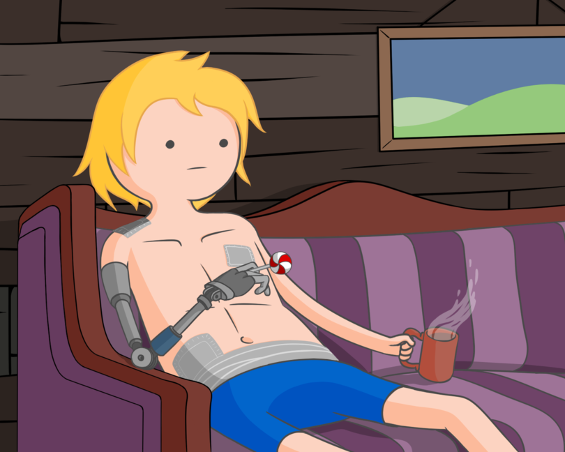

# -TRAINING-  

Репозиторий для хранения изучаемых проектов по:  

- аналоговой схемотехнике
  - схемы на биполярных транзисторах
  - схемы на операционных усилителях
- программированию на языке С
  - консольные приложения
- программированию микроконтроллеров ATMEL AVR
  - язык C
    - ATtiny2313
  - язык Assembler
    - ATtiny13A  
- программированию на языке JAVA
  - консольные приложения			